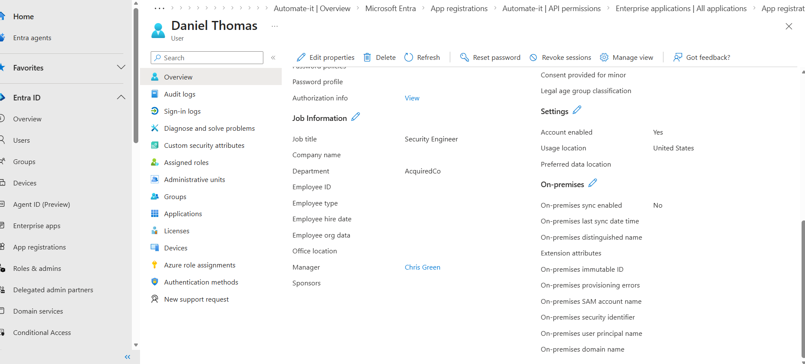
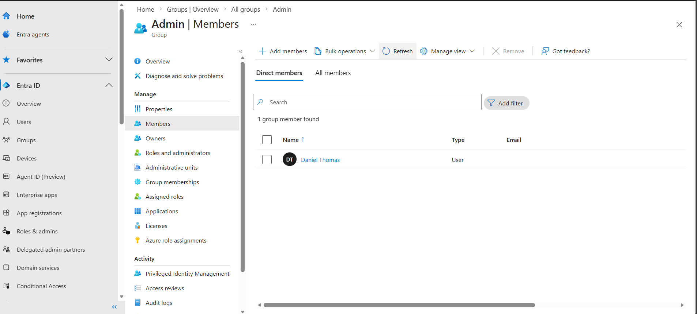
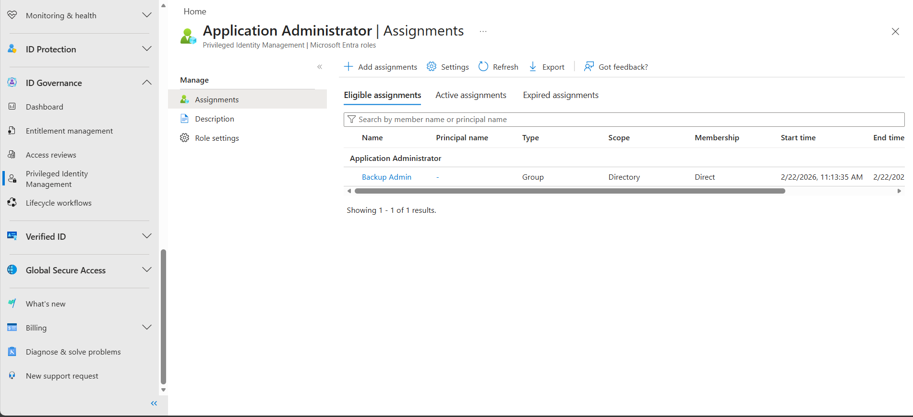
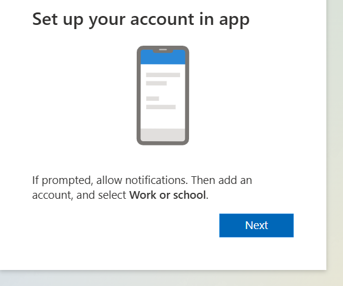
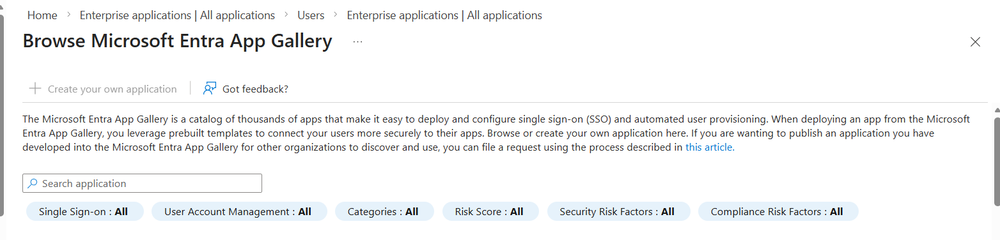

## Task -1 

**Build the “Merger Wave” user set (bulk onboarding)**

The sample users from the company merger has been imagined and documented in the [CSV](users.csv) File. This is the exact template from the Microsoft Lab I have added attributes such as company, manager, roles and so on.

Those users can be onboarded with the automation. I have used a [powershell script](onboardingAutomation.ps1) to onboard the users from the CSV files and established a direct manager relation for one of the users. 

## Task 2:

**Design a least-privilege admin plan (role mapping)**

There are two groups in the Entra Domain 

1. Security Group : Used for managing access to resources and support nested structure **Permission Group**

2. Microsoft 365 : Used for collaboration **Team Communication**

I have imagined a security engineer role in the acquisation users and planning to providing them a cloud app admin role. 

The Parent Co. already have a security group which has the Cloud App Admin role permission. Instead, of adding a manual role or permission to each user I would add the Security Engineer to that Security Group.

But, as the requirement is a **least-priviledge role**, just enough role to perform the duty, I found a Application Admin role which adhere to the principle of the least priviledge. 

**Comparision between Cloud App Admin vs App Admin** 

Cloud App Admin Vs Application Admin 

| Capability               | Application Admin | Cloud Application Admin |
| ------------------------ | ----------------- | ----------------------- |
| Manage Enterprise Apps   | ✅                 | ✅                       |
| Manage App Registrations | ✅                 | ✅                       |
| Configure SSO            | ✅                 | ✅                       |
| Manage Secrets/Certs     | ✅                 | ✅                       |
| Grant Admin Consent      | Limited           | Broader                 |
| Application Proxy Mgmt   | Limited           | Full                    |
| Tenant-wide App Control  | Moderate          | Broad                   |

Adding the Security Engineer to Admin group

## Task-3
**Implement time-bound admin access**

Now, I will use the user with the Tech Lead role and make him a backup admin with PIM and JIT.

Backup admin has the permission same as the Application admin but for a limited time. i.e. 1hours for now

### Testing the assignments 

MFA prompt appears when try to login to the priviledge users 

With Eligible Permission

Once I removed the Eligible Permission the user should be able to able to create a application

This completes the privilege boundary negative and positive testing.

## Task-5 

**Operationalize: produce an audit-ready runbook**

**RunBook: Application Administrator Role Governance**

**Purpose:** 

This runbook defines the controlled assignment and lifecycle management of App Admin role in Entra ID. 

**Objectives:**
1. Enforce Least Privilege
2. Use JIT 
3. Require Business Justification
4. Audit Ready Evidence 
5. Reduce Blast Radius

**Role Scope**

https://learn.microsoft.com/en-us/entra/identity/role-based-access-control/permissions-reference#application-administrator

A privileged role that can 
* Create and manage all aspects of enterprise applications, application registrations, and application proxy settings.

* Ability to consent for delegated permissions and application permissions except of application permission for Azure AD Graph and Microsoft Graph. 

**Role Request Criteria** 

Must be part of Security Team with documented responsibility for application onboarding, SSO configuration, service principal configurarion and credential rotation. 

Must complete RBAC and Least privilege training, secure app registration training and enrolled in Phising resistant MFA enrollment.

**Approval Expectations** 

For lab environment self approved via PIM for learning and testing purpose. 

If in the Production or Real World Scenerio the flow likely would be 

1. Access Request Submitted by Security Engineer 
2. Business Justification Approval by Direct Manager 
3. Technical Approval by IAM or Security Team Lead 
4. Activation via Automation with audit trails and logs.

**Mandatory Conditions** 

* MFA required at activation
* Justification required
* Maximum activation duration enforced (1-8 hrs)
* Eligible assignment

**Access Model** 

PIM Eligible Assignment with Just-in-Time(JIT) activation and time bound duration.

**Activation Process** 

1. Assign user as a Eligible with the mandatory conditions settings. 
2. In the PIM, requests activation with business justification, when the MFA challenge completes the role becomes temporarily active.
3. As we have time bound duration role expires automatically.

**Removal Process** 

Automatic Expiry verified via audit logs. 

If the role no longer needed or work has been done ahead of time, IAM admin removes the eligible assignment, audit log verification completed and access re-test to verify the change has been successful. 

If role changed or requires higher privileged role, immediate removal of eligible assignment and review for additional privileged roles and document the revocation confirmation.

**Privilege Boundary Validation** 

Documented in Task-3. In summary before assignment attempt to create app registration, denied. After assignment success and post expiry denied. 

**Evidence Checklist** 

Access request ticket, manager approval record, IAM approval record, eligible assignment record. 

Same steps verified via PIM logs like add eligible member to role, activate eligible role, remove eligible role and role expiration event.

MFA Logs and Conditional enforcement record if applicable.

## Knowledge Check (Answer briefly)

**Why is “Application Administrator” a better choice than “Global Administrator” for this scenario, and what risk does it reduce?** 

Global Admin can modify users, roles, conditional access, and security policies across the entire tenant. It's way more permission than required for this task. It violates the principle of the least priviledge and significinatly increase the blast radius if the account is breached or misused.

**Explain the difference between “Eligible” vs “Active” role assignment (PIM) and how that changes your attack surface**

Eligible roles must be activated temporarily via PIM, with MFA and justification, and it expires periodically which active role is permanent and always available. 

Active assignments creates standing privileged access while eligible assignments reduce attack surface by hardnening the identity with time-bound, MFA and monitored access.

**If you had to do this at scale, why is Graph/PowerShell-based onboarding and role management operationally safer than portal-only clicks?**

Automation via powershell and Graph is safer and scalable because the scripts can be reused, versioned controlled and reviewed which reduces the error and even if error occurs it's documented via version controlled and can be corrected. Automation can enforces least privilege configurations at scale and has clear logs and deployment history.

Note: *i will revisit the labs in future and make improvement if i am mistaken in any of the aspects.*