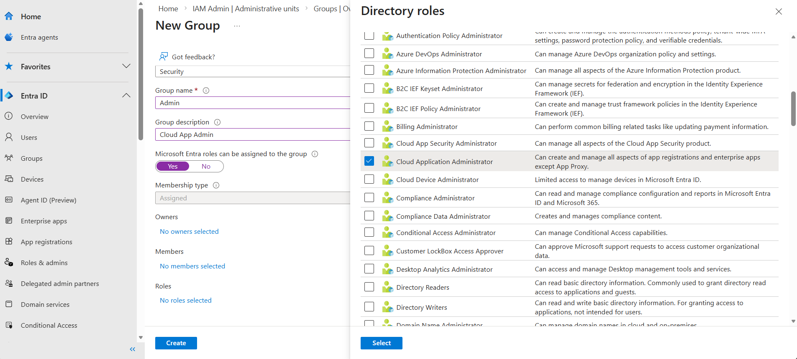
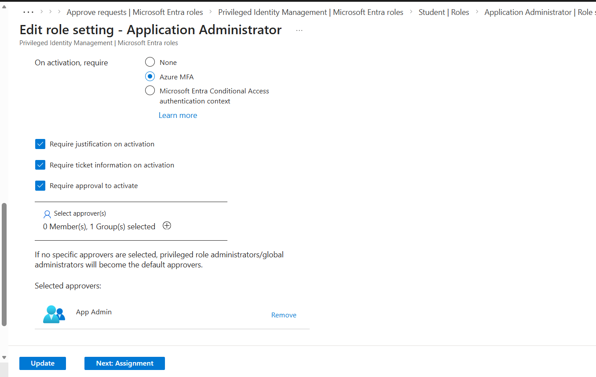
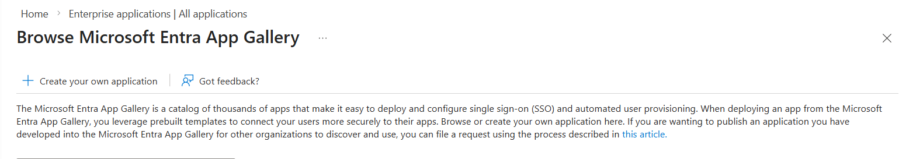

## WIP

I have created a sample acquired user database and would use a automation in powershell to insert those records in the Entra ID [csv.ps1](csv.ps1)

Apart from the Sample CSV provided by  the micorsoft lab, I have imagined the Manager role to assign the manager to one of the Employee and it's reflected in the User Dashboard.

Task 1 Done

Task 2: 

There are two groups in the Entra Domain 

1. Security Group : Used for managing access to resources and support nested structure **Permission Group**
2. Microsoft 365 : Used for collaboration **Team Communication**

I have imagined a security engineer role in the acquisation users and planning to providing them a cloud app admin role. 

The Parent Co. already have a security group which has the Cloud App Admin role permission. Instead, of adding a manual role or permission to each user I would add the Security Engineer to that Security Group.

But, as the requirement is a least-priviledge role, just enough role access to perform the duty. 

Cloud App Admin Vs Application Admin 

| Capability               | Application Admin | Cloud Application Admin |
| ------------------------ | ----------------- | ----------------------- |
| Manage Enterprise Apps   | ✅                 | ✅                       |
| Manage App Registrations | ✅                 | ✅                       |
| Configure SSO            | ✅                 | ✅                       |
| Manage Secrets/Certs     | ✅                 | ✅                       |
| Grant Admin Consent      | Limited           | Broader                 |
| Application Proxy Mgmt   | Limited           | Full                    |
| Tenant-wide App Control  | Moderate          | Broad                   |

So, instead of granting Cloud App Admin, I would grant this user Application Admin to adhere least priviledge requirements.

Adding the Security Engineer to Admin group

Now, I will use the user with the Tech Lead role and make him a backup admin with PIM and JIT.

Backup admin has the permission same as the Application admin but for a limited time. i.e. 1hours for now

### Testing the assignments 

MFA prompt appears when try to login to the priviledge users 

With Eligible Permission

Once I removed the Eligible Permission the user should be able to able to create a application

