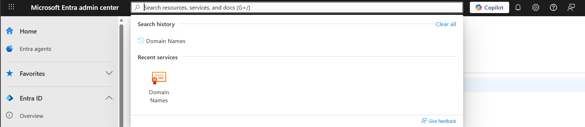
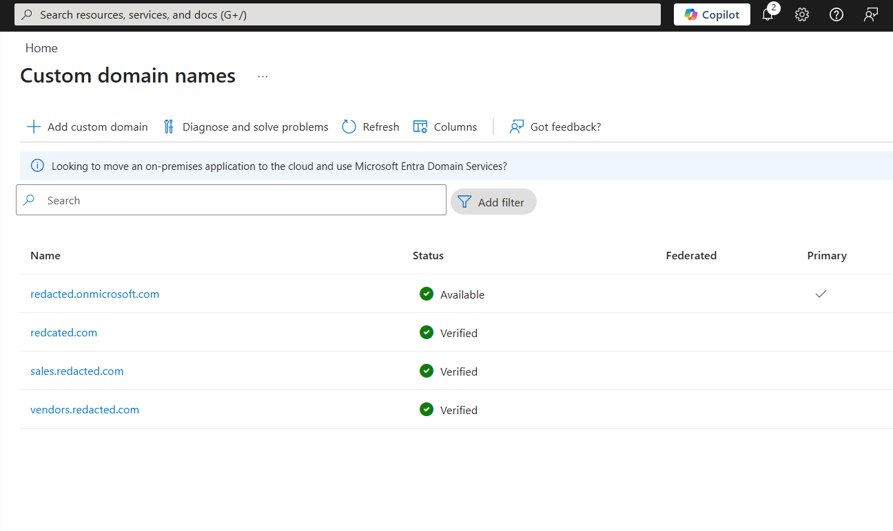
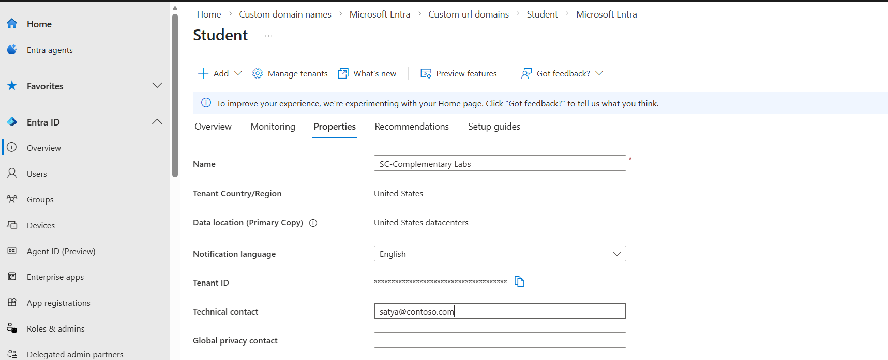

## Introduction

This task is a general configuration tasks and depends on the UI functionality. As the cloud is agile and UI changes often. I would documents the steps for my future references and as a pointer to someone reading it. 

## Task-1

**Design and implement a tenant namespace plan (subdomains)**

1. In the Microsoft Entra ID, search for the Domain Name in the search bar.

    

2. Then, add a custom domain name. You can use a any domain name that you own or prove. You need to configure the TXT record and MX records provided by the Entra to prove that you are the owner of the domain you provided. 

    Note: *Entra doesn't allow any .onmicrosoft.com domains as a custom domain.*

    The custom domains added for sales and vendors subdomains

    

**Document what each subdomain is for (UPN naming, partner separation, future custom domain mapping).**

1. **sales.contoso.com**: 
    
    **Purpose:** Dedicated namespace for new sales business unit.

    **UserPrincipleName(UPN) Naming:**

     * Use this for sales user's UPNs to make identities instantly recognizable.

     * Pattern can be firstname.lastname@sales.contoso.com 

     * Clean identity scoping for searches, reporting, and admin operations.

    **Partner Separation**: Clear distinction from vendor/guest identities. It help avoid "mixed identity" issues.

2. **vendor.contoso.com**: 
    
    **Purpose:** Namespace for partner/vendor collaboration and clear seperation from the internal staff identities.

    **UserPrincipleName(UPN) Naming:**

     * For B2B guests, vendors keep their home identity (e.g. user@vendor.com) and appear as guest.

     * If and only if they need internal identities, pattern can be `vendorname-contact@vendors.contoso.com` 

    **Partner Separation**: Clear distinction from internal staffs.  It help avoid "mixed identity" issues.

## Task-2 

**Set “ownership” metadata: tenant display name + technical contact**

Tenants metadata can be updated via a Properties menu in a overview page. 

## Task-3

**Operationalize it: export tenant properties via Graph/PowerShell** 

The automation script [tenant](tenant.ps1)

JSON as a proof [Org](org.json)