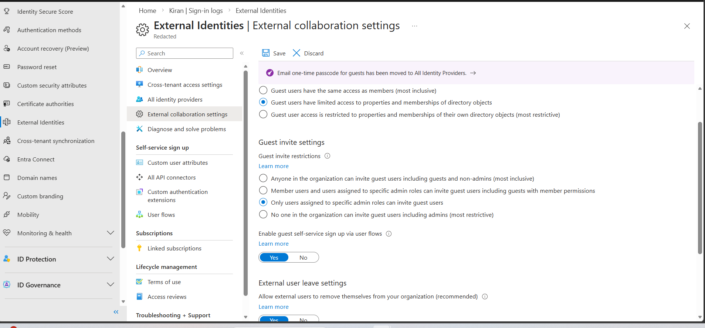
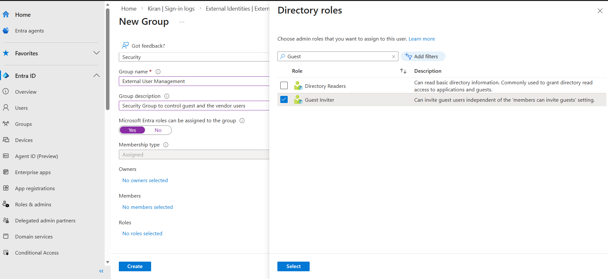
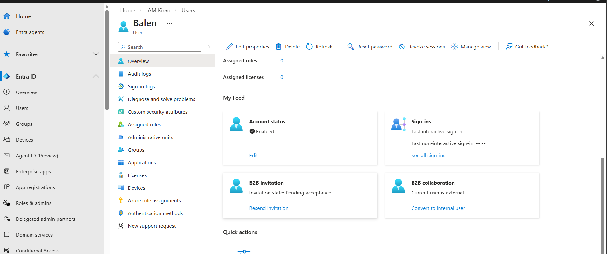
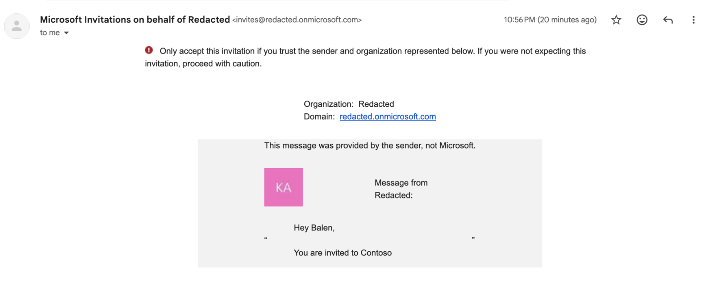
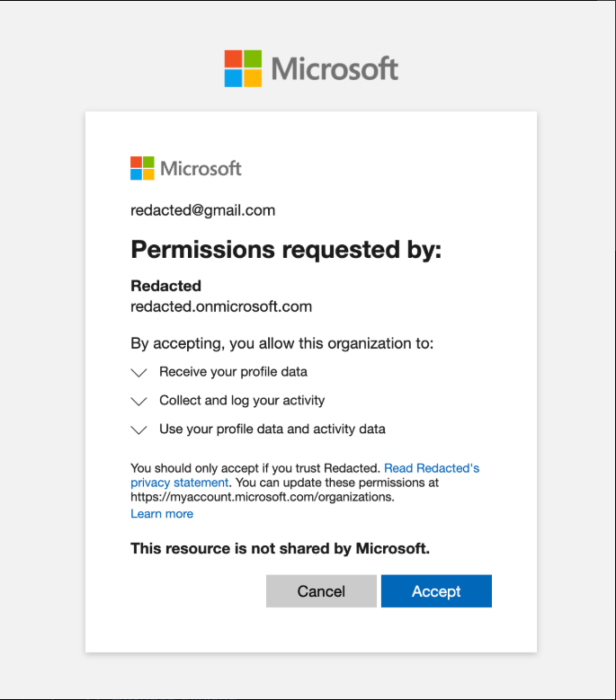
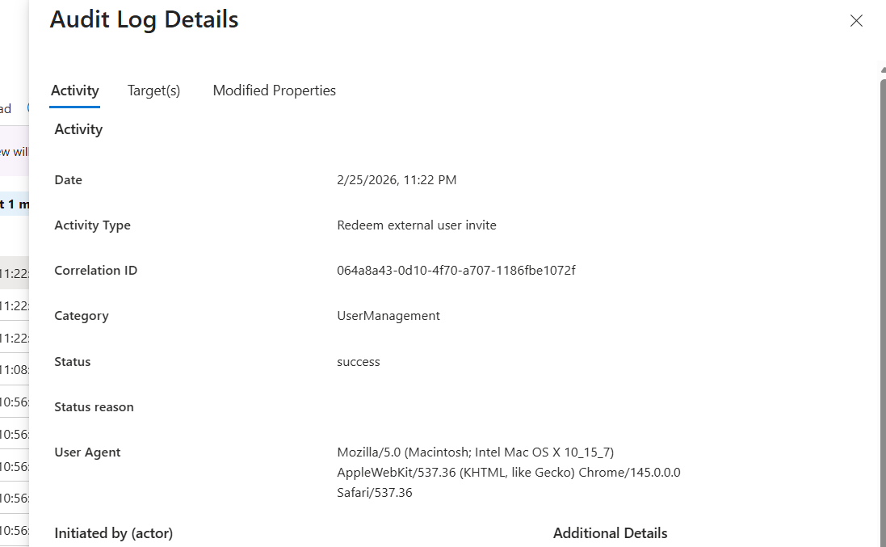
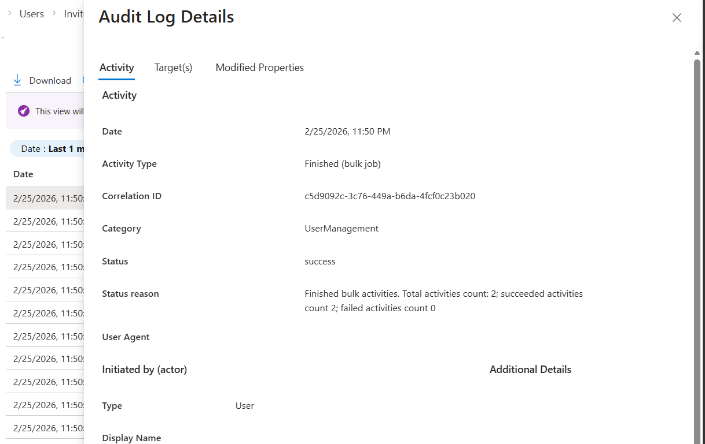
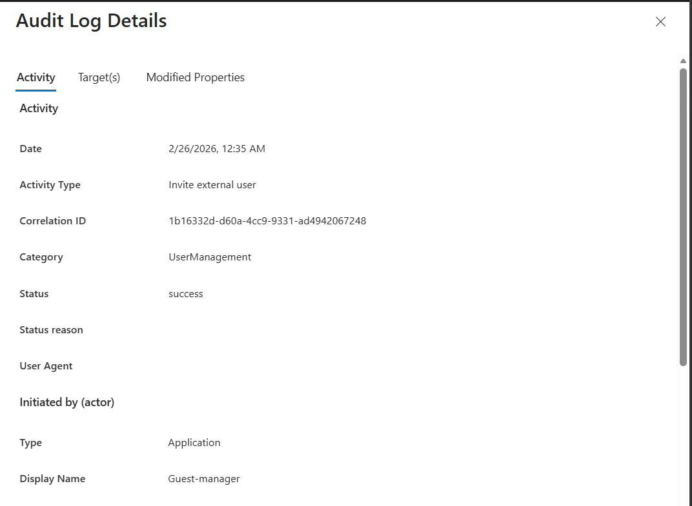

### Designing the control Plane 

For the guest/vendor collabaration to our Contoso organization. A dedicated security group is only allowded to invite the guest users. 

To enforce such restriction, 

Under Entra 

1. External Identities ->
2. External Collobaration Setting -> 
3. Under Guest Invite Setting; allowing Only users assigned to specific admin roles can invite guest users

This is the global tenant setting. 

Now, we need to create a user with required roles, following the principal of least priviledge, providing just required access to perform the job. i.e. Invite the external User

### Automation Application

For the automation capabilities, we have to create a enterprise application with limited scope of inviting the user.

User.Invite.All: https://graphpermissions.merill.net/permission/User.Invite.All?tabs=apiv1%2Cinvitation1

Since, we have guardrails in the tenant level that only users/app in the specific security group or specific admin role can invite the user. We have to add this application to the security group.

### Manual Invitation
This is similar to creating a member user. 

Under Users-> New Users -> Invite Guest User 

After the successful invitation users were supposed to get the invitation email. 

Here is the changelog from Microsoft:

 https://learn.microsoft.com/en-us/entra/external-id/invitation-email-elements?WT.mc_id=Portal-Microsoft_AAD_UsersAndTenants

 Since they rollout this changes some external guest users are unable to receive the automated invitation email

 https://learn.microsoft.com/en-us/answers/questions/5737161/since-end-december-2025-add-user-%29-invite-external

 If your guest users doesn't get the invitation mail then you need to sent it to manually. 

 

 My invited guest user got the mail in the spam folder. 

 

 Consent Screen 

 

 This relates to the privacy statement and the branding we have done in the [Lab-2](../challenges-1/challenges-1.md) 

 Audit log 

 

 ### Bulk Invitation

 Bulk Invitation is similar with Bulk Creation that we have accomplished in the [Lab-1](../challenges-1/challenges-1.md)

 Users -> Bulk Operation -> Bulk Invite 

 Edit the example CSV to include the user email address and tenant id in the redirect URL and upload it.

 Bulk Invite Audit logs 

 

 ### Automation 

 It's more of similar to the User Create automation. 

 References: https://learn.microsoft.com/en-us/entra/external-id/b2b-quickstart-invite-powershell

 [Powershell](inviteAutomate.ps1)

 [GuestCSV](guestInvite.csv)

 Guest manager audit log 

 