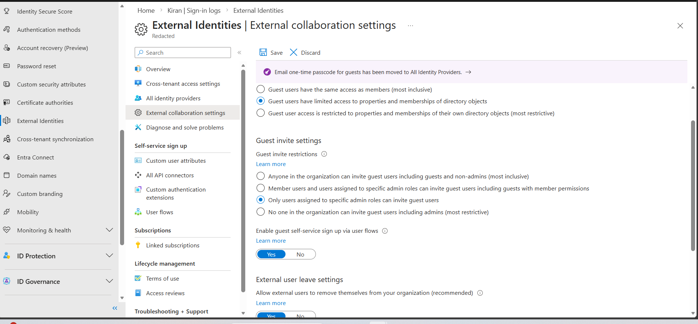
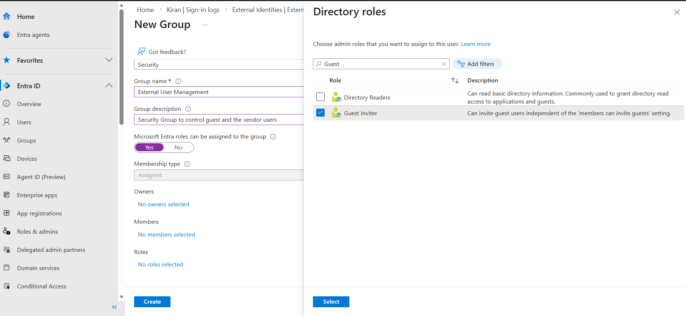
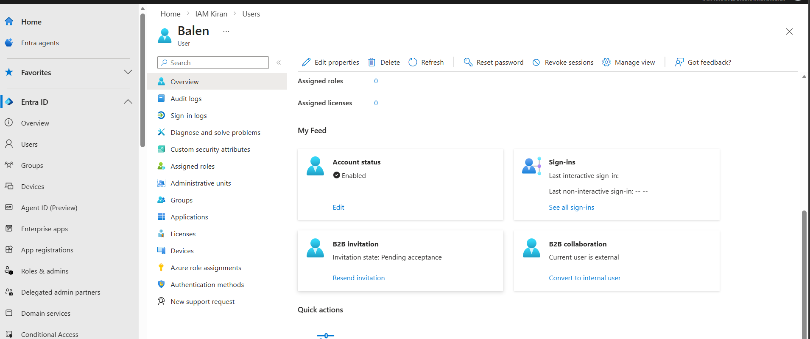
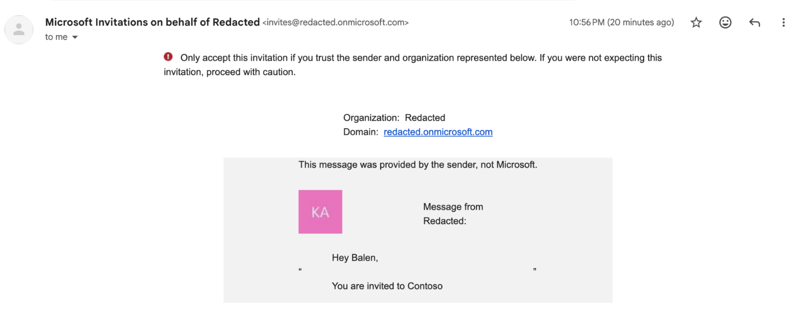
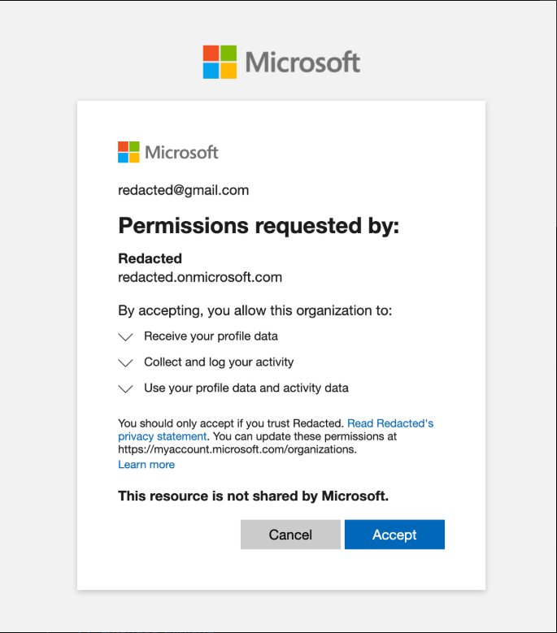
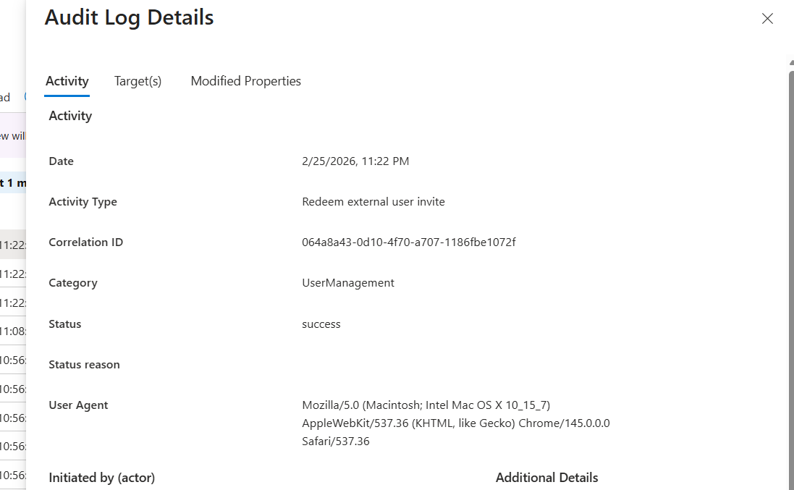
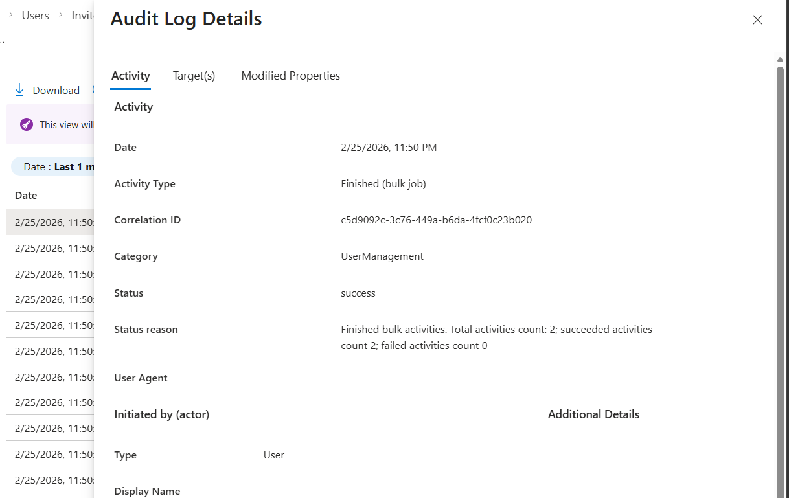
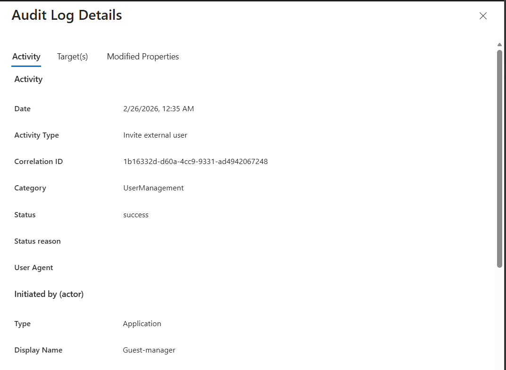

### Designing the control Plane 

For the guest/vendor collabaration to our Contoso organization. A dedicated security group is only allowded to invite the guest users. 

To enforce such restriction, 

Under Entra 

1. External Identities ->
2. External Collobaration Setting -> 
3. Under Guest Invite Setting; allowing Only users assigned to specific admin roles can invite guest users

This is the global tenant setting. 

Now, we need to create a user with required roles, following the principal of least priviledge, providing just required access to perform the job. i.e. Invite the external User

### Automation Application

For the automation capabilities, we have to create a enterprise application with limited scope of inviting the user.

User.Invite.All: https://graphpermissions.merill.net/permission/User.Invite.All?tabs=apiv1%2Cinvitation1

Since, we have guardrails in the tenant level that only users/app in the specific security group or specific admin role can invite the user. We have to add this application to the security group.

### Manual Invitation
This is similar to creating a member user. 

Under Users-> New Users -> Invite Guest User 

After the successful invitation users were supposed to get the invitation email. 

Here is the changelog from Microsoft:

 https://learn.microsoft.com/en-us/entra/external-id/invitation-email-elements?WT.mc_id=Portal-Microsoft_AAD_UsersAndTenants

 Since they rollout this changes some external guest users are unable to receive the automated invitation email

 https://learn.microsoft.com/en-us/answers/questions/5737161/since-end-december-2025-add-user-%29-invite-external

 If your guest users doesn't get the invitation mail then you need to sent it to manually. 

 

 My invited guest user got the mail in the spam folder. 

 

 Consent Screen 

 

 This relates to the privacy statement and the branding we have done in the [Lab-2](../challenges-1/challenges-1.md) 

 Audit log 

 

 ### Bulk Invitation

 Bulk Invitation is similar with Bulk Creation that we have accomplished in the [Lab-1](../challenges-1/challenges-1.md)

 Users -> Bulk Operation -> Bulk Invite 

 Edit the example CSV to include the user email address and tenant id in the redirect URL and upload it.

 Bulk Invite Audit logs 

 

 ### Automation 

 It's similiar  to the User Create automation. 

 References: https://learn.microsoft.com/en-us/entra/external-id/b2b-quickstart-invite-powershell

 [Powershell](inviteAutomate.ps1)

 [GuestCSV](guestInvite.csv)

 Guest manager audit log 

 

**What exactly gets created in Entra the moment you send an invitation—before the user accepts it—and why does that matter for audits and cleanup?** 

When we send a invitation to the guest user, Entra immediately creates a guest users in a directory with `#EXT` extension. It also creates a Invitation Record with a URL and a redeem status.

For the audits, it provides a trail of the invitation and successful redemption/sign on.

For cleanup, the invitated records doesn't stale or auto deleted itself, they will accumulate until and unless we review and delete them.

**Why is the “redirect URL” a security-relevant setting, not just a convenience setting?** Describe one misuse scenario and how you’d prevent it. 

redirectURL in a OAuth2.0 is security critical because IdP sends a authorization code to the redirectURL, the code is short lived, redeemed once to get the tokens. If attacker or malicious user tweak the redirectURL and redeem them before the legimate users they can get the token. 

To prevent such attack strict redirectURL matching is must, no explicit wildcard allowed. Furthermore, PKCE and authorization codeflow enhances the security.

**Least privilege reasoning:** For PowerShell/Graph invitations, compare `User.Invite.All` vs `User.ReadWrite.All`. Why is one safer, and when might you still need the broader one? 

Adhering to the principle of Least priviledge, for the user invitatoion `User.Invite.All` is more appropriate because it's scoped to inviting the guest user. 

`User.ReadWrite.All` has broad permission of managing the users by app read and update user profiles across the org. This will increase the blast radius in case of compromise.