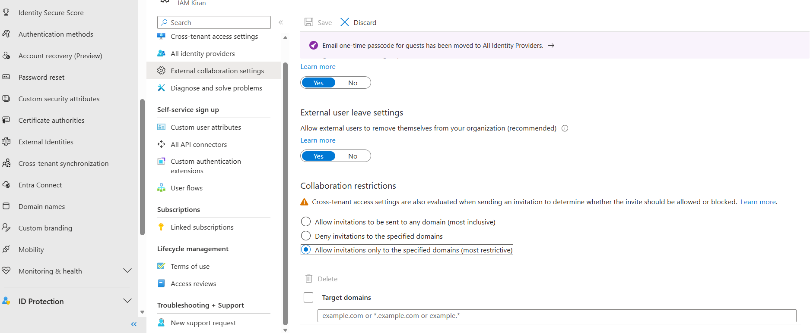
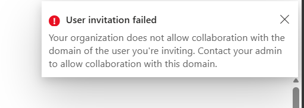
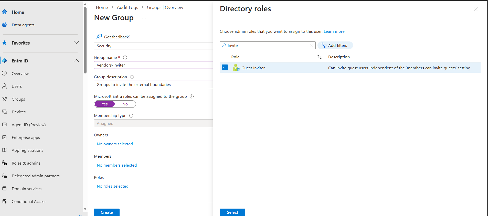
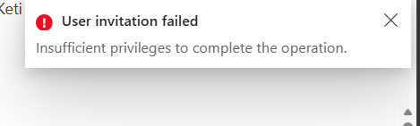
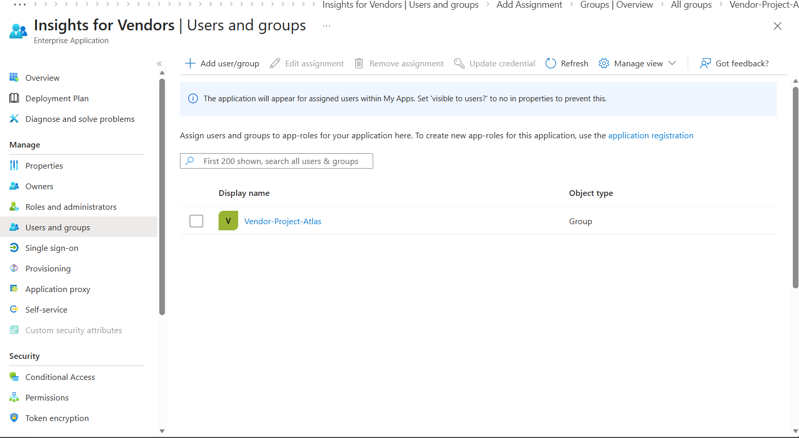
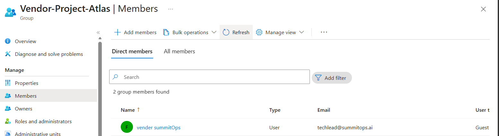
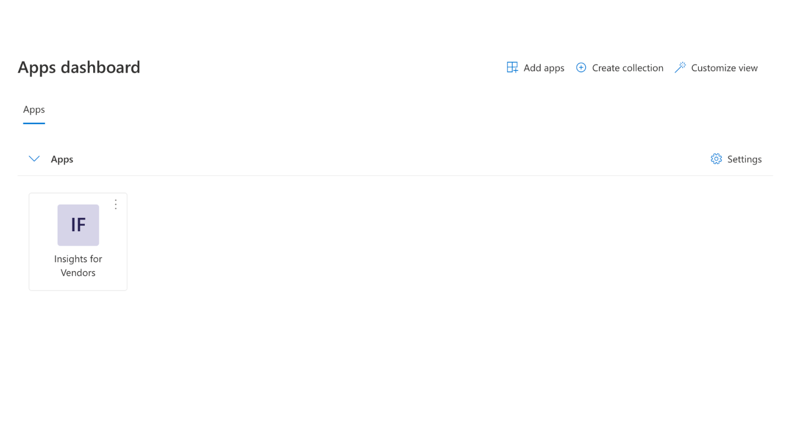
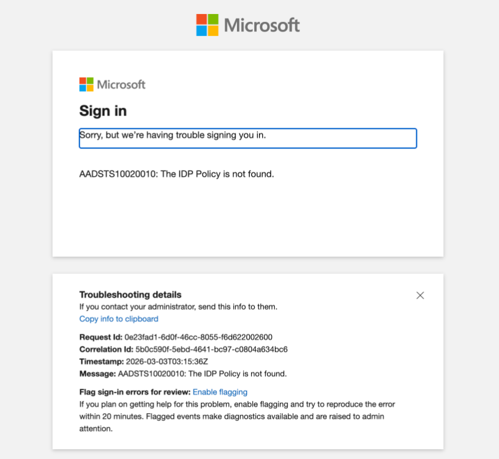
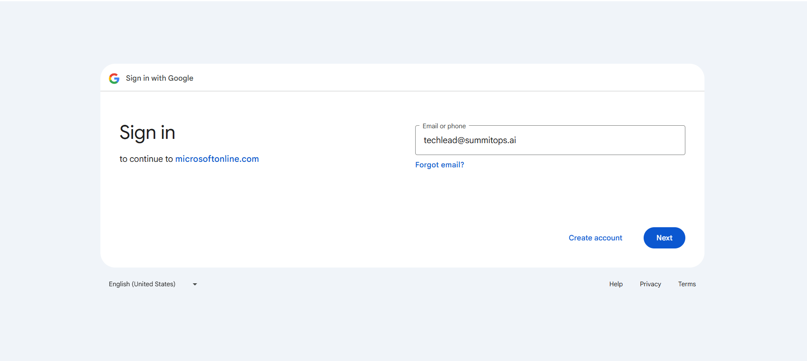

2. **Add “vendor guardrails” before inviting anyone**

   **Configure External Collaboration settings to **allow only SummitOps’ email domain(s)** for invitations (block everything else), and ensure guest access is appropriately restricted for your scenario. (Think “we’re collaborating with a vendor,” not “we’re adding employees.”)**

   Inorder to allow only vendors with certain subdomains to colloborate we can impose the restriction, while this restriction is Global impacting the whole tenant. We can add multiple allowed domains in the domains list. 

   This would improve the security posture and reduce the risk of mis-typed or uninformed admin to add users from the other domains. 

   

   If we try to invite users other than the specified domain then, we will see this error message 

   

3. **Implement a controlled invitation model (who can invite)**

   * Create a security group like **Vendor-Inviters** and restrict guest invitations to only that group (not all users).
   * Explain the operational reason (prevent uncontrolled external sprawl) and the audit reason (provable control over external onboarding).

   To maintain the permission boundaries and seperation of the duties, we will create a group called **Vendor-Inviters** and give them just enough access, `User.Invite.All` and designate some members in this group who are responsible to invite vendors.

    

   We already worked and explained the groups. Keeping it short for this task.

   Negative Test, 

   When I logged in from the user who doesn't have permission to add the guest users, who aren't memeber of Vendor-Inviters group they can still see the options to invite the user but when they submit the request they would get this error message.

   

   Positive Test, 

   I would add the user to the group and re-try same invitation flow, 

   

4. **Scope the vendor’s access (don’t just “let them in”)**

   * Grant access to **only one target resource** (the “Vendor Support Portal” enterprise app, a test app)
   * Ensure access is **time-bounded** (expiration) and can be reviewed/removed cleanly at contract end.

For, this task I have created a Enterprise application called **Insights for Vendors** in earlier lab. 

Note: 

To allows only assigned users to see the applications these boxes should be checked.

**Vendor-Project-Atlas**

The workflow will be like this, there is a security group called **Vendor-Project-Atlas** which is for the vendor members. 

I have created a application called **Insights for Vendors**, and assigned a security group. 

And added a guest members or vendors members to the security group **Vendor-Project-Atlas**

From the Guest Screen, they should be able to see the apps as 

5. **Validate sign-in + collect evidence (audit-ready)**

   * Complete an end-to-end test: invite a test SummitOps user, redeem invitation, and sign in using Google federation (verify the experience differs from non-federated flows).
   * Pull evidence from **Sign-in logs** and **Audit logs** showing (a) IdP configuration changes and (b) the external user sign-in event.

To test the federation, I will add the some users to Google Application that we created following Microsoft official labs. 

I will invite the same users in the app to see federation in action. 

For, second case I will invite a user directly without adding them to the Google Application Test Users.

First, Invite without Federation

With the federation

And consent screen afterwards

1. **Federation vs. “just inviting a guest”:** What security and user-experience difference do you get when Google federation is configured correctly (especially around extra verification / redemption flow)?

Without a federation, users has to use a one time code or microsoft account flow.

With a federation users will be redirected to the federated IdP (Google in this case) and OAuth2.0 would take over. After the consent screen users would be redirected to dashboard. 

Security wise, 

Without federation, there can be risk of MiMT or OTP harvesting while federation minimizes such risk. Furthermore, Google as a IdP triggeres the MFA policies if configured and other risk based checks to secure the identities.

2. **Control plane question:** Why is “allowing Google as an IdP” *not* sufficient by itself—what specific risks remain if you don’t restrict domains and who can invite? 

No restricting who can invite violates the segeration of duties and principle of least privileges. If anyone can invite any users then it would be difficult to control the identities and increase the risk of insider threat. 

Domain restriction helps safeguard from  mistyped or typosquatted domain adding extra layer of security on who are allowed to be guest within the tenant.