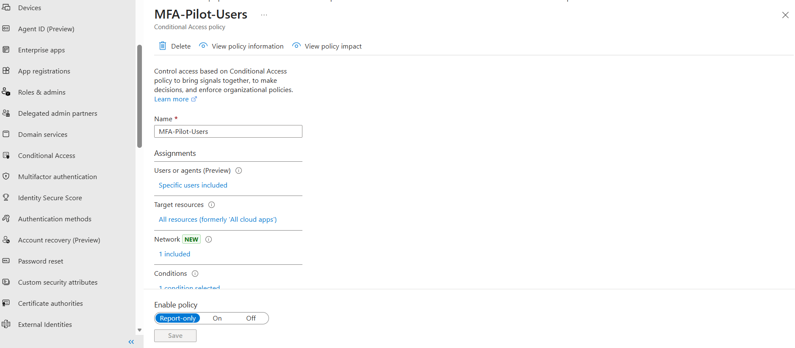

1. **Design your rollout groups (and exclusions)**

   * Create or identify:

     * `MFA-Pilot-Users` (small set)
     * `Privileged-Users` (admins / elevated roles)
     * `BreakGlass-Accounts` (1–2 emergency access accounts)
   * Document *why* break-glass accounts must be excluded from some Conditional Access policies (and how you’ll secure them differently).

To apply the MFA to small sets of the users i.e. `MFA-Pilot-Users` we can create a security group and add the users whom we want to test the MFA rollouts first.  

Break-Glass, originates from "In case of fire, break glass, and pull alarm". [Explanation](https://www.idsalliance.org/blog/break-glass-accounts-risk-or-required/)

BreakGlass accounts are highly privileged, pre-staged accounts reserved for emergency scenarios where standard access methods are unavailable or insufficient.

Why breakglass accounts must be excluded from some Conditional Access Policies, because those accounts are mostly designed for emergency access and if they are behind the conditional access with different heuristic signals, policy misconfiguration or dependency, then their is high chances of lock out. This defeats the purpose of the breakglass account. 

To rollout 

1. MFA-Pilot Users: A small set of users used to validate the user impact in Report-only then On.

2. Priviledged Users: Rolled out with stricter controls such as Phishing-Resistant MFA, Device Compliance, Location signals. Compromised priviledge account has a higher blast radius then the normal account. 

3. BreakGlass Account: They are the emergency accounts used when normal access fails may be due to misconfiguration of Conditional Access, MFA outage or IdP/federation outage. Microsoft, themselves has recommeneds excluding those emergency accounts from CA policies to prevent tenant lockout.

To secure breakglass account as a compensating controls we can create more than 2 emergency accounts with strong, independent authentication. The credentials must me stored securely and emergency accounts should be monitored with higher caution with sign-ins/audit logs. 

2. **Enable modern MFA enforcement strategy (avoid legacy traps)**

   * Confirm you are enforcing MFA through **Conditional Access**, not only “per-user MFA” states.
   * Record what can go wrong operationally if someone enables **per-user MFA** for a user who is also targeted by Conditional Access (think: precedence, troubleshooting confusion, inconsistent prompts).

For this tasks let's create a conditional access in a small pilot users group. 

I will create a security groups for the pilot users and add users to the group.

A conditional access is evaulated as an **and** condition, it doesn't have any precedence, meaning it has to be true for all the evaulated condition. Each policy is evaluated on its own, and if multiple policies apply, all applicable policies must be satisfied.

If the per-user MFA is enabled then our scoped rollout of MFA polices behaves differently, the users that shouldn't yet receive MFA Prompt (Users excepts Pilot Users) will receive the MFA prompt. For the pilot users covered by the CA policies it would cause a inconsistent prompts, broken rollout assumptions and a confusing troubleshooting.

3. **Create two Conditional Access policies (start safe)**

   * **Policy A: “MFA Pilot – Microsoft 365”**

     * Target: `MFA-Pilot-Users`
     * Cloud app: Microsoft 365 (or your test enterprise app)
     * Grant: Require MFA
     * Start in **Report-only**, then move to **On** after validation.
   * **Policy B: “Admin Access – Phishing-Resistant MFA”**

     * Target: `Privileged-Users`
     * Target resources: admin portals / high-impact apps you choose
     * Grant: require **phishing-resistant MFA** (via Authentication Strengths)
     * Exclude: `BreakGlass-Accounts` 